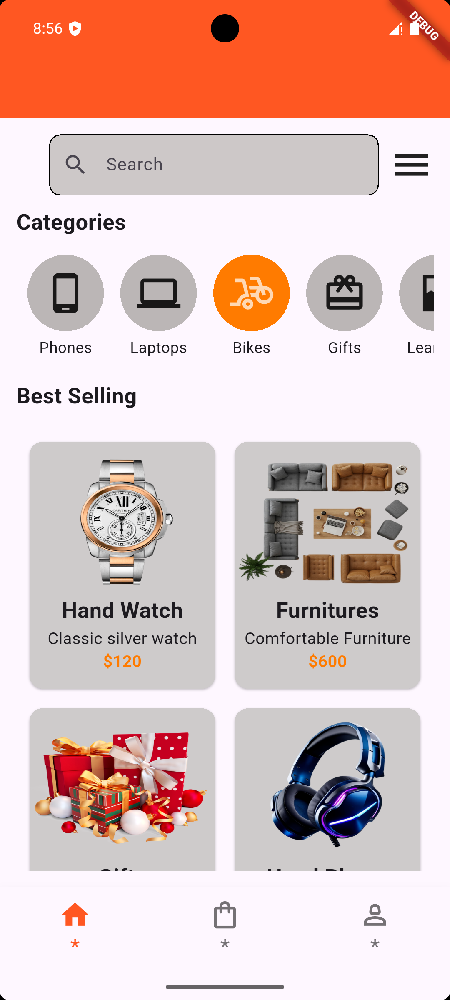
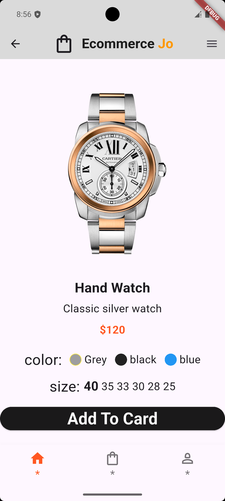
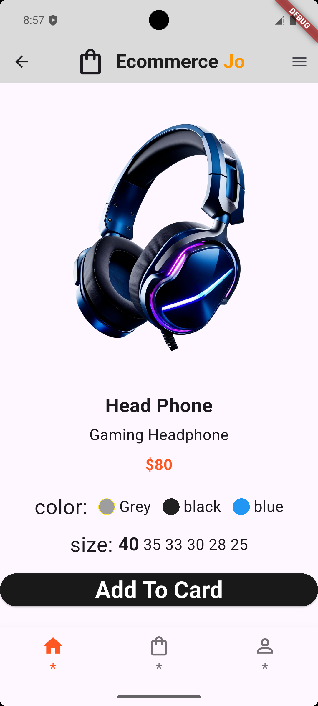

 🛒 Ecommerce App

A simple and clean Flutter Ecommerce UI Application that displays product categories, best-selling items, and detailed product pages with color and size selection. The app uses a modern interface and smooth user experience.

🏠 Home Screen 

🛍️ Product Details Screen 

 Features 

* Modern Home Screen UI
* Product Categories Section
* Best-Selling Products Grid
* Product Details Page
* Color Selection
* Size Selection
* Bottom Navigation Bar
* Clean and simple design
* Easy to customize

 Tech Stack

* Flutter
* Dart
* Material Design Widgets
* ListView & GridView
* Local Assets Management

 📂 Project Structure

 lib/ 
 ├── HomePage.dart
 ├── itemDetails.dart
 ├── CustomCard.dart
 ├── AboutUs.dart
 ├── Contact.dart

assets/
 └── images/
 ▶️ Run the Project

bash
flutter pub get
flutter run

👨‍💻 Developer 

Developed by Youssef Nasr 
A simple Flutter UI practice project for Ecommerce applications.
